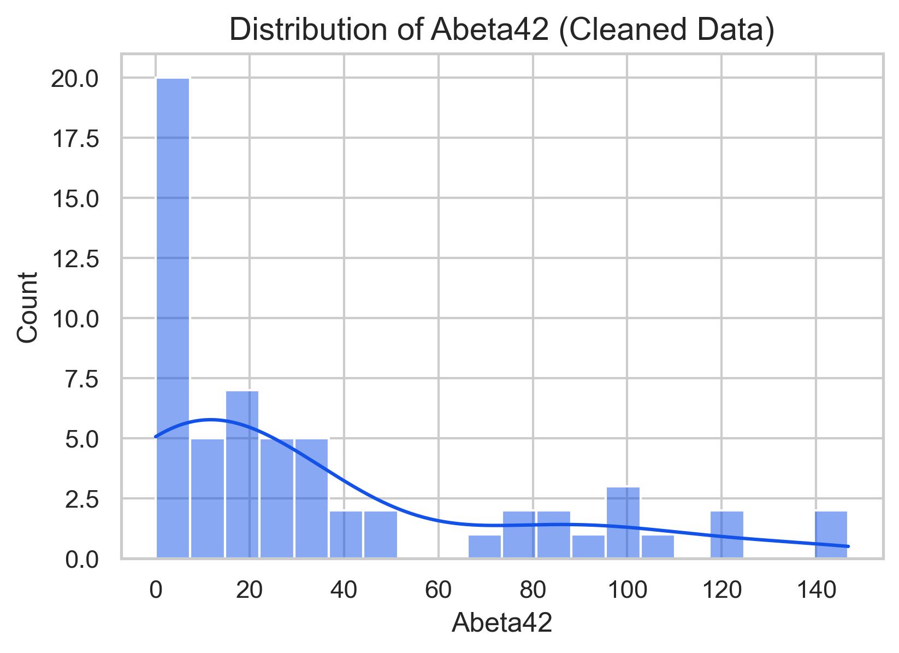
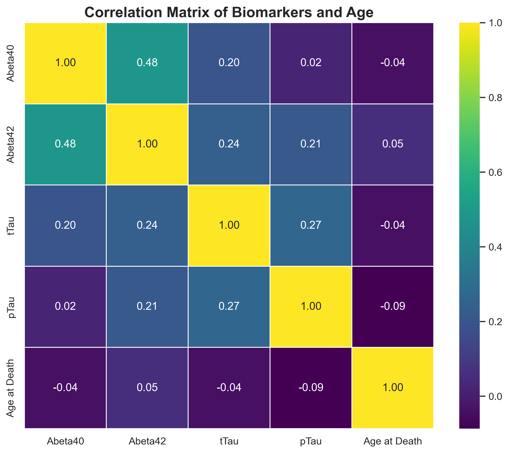
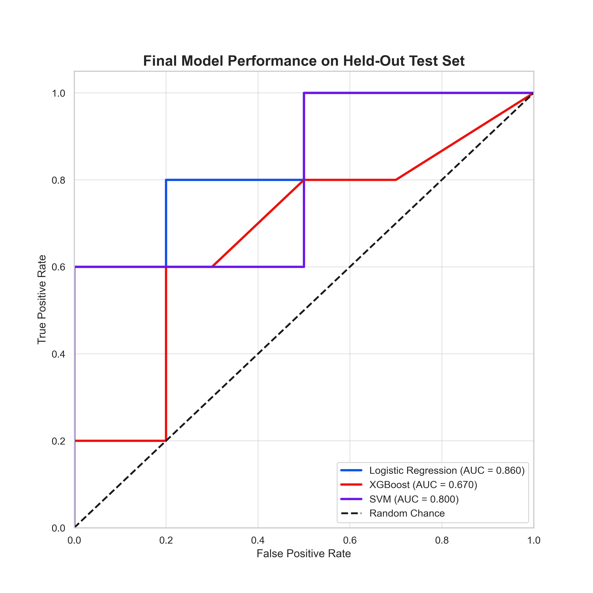
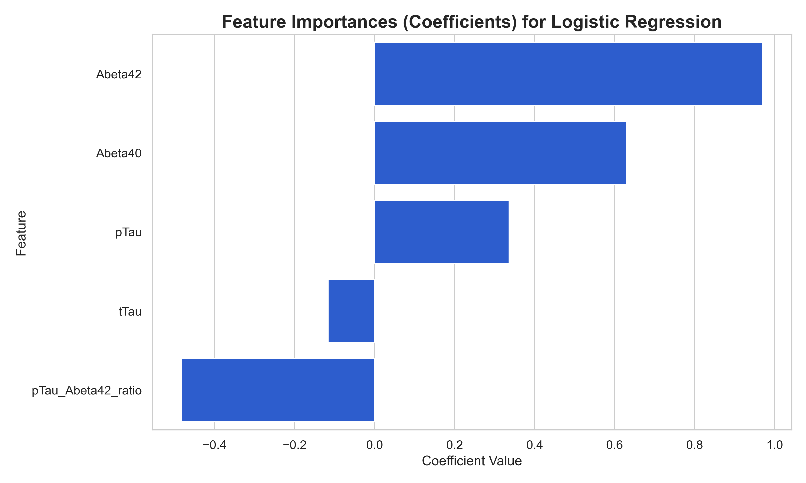
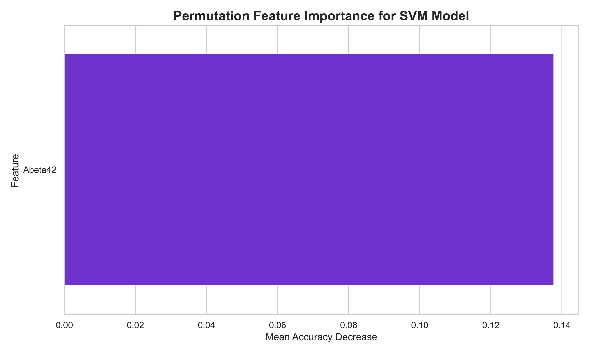
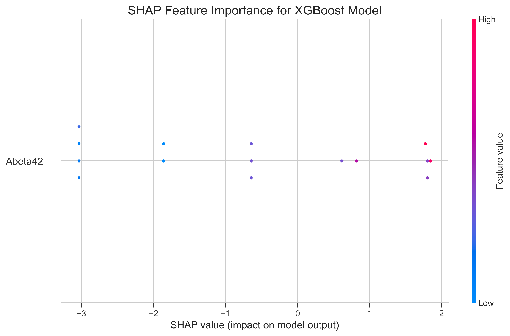

# AD Biomarker Classification: A Model & Feature Selection Study

## Abstract
This project develops and evaluates a robust machine learning pipeline to classify Alzheimer's Disease (AD) neuropathological status using protein biomarkers from the Allen Institute's SEA-AD cohort. A systematic comparison of three model architectures (Logistic Regression, XGBoost, SVM) and multiple feature engineering strategies was conducted. Using a rigorous, repeated cross-validation framework, the analysis revealed that a non-linear Support Vector Machine trained on a single, algorithmically-selected biomarker (Abeta42) provided the most robust and accurate predictions, demonstrating the power of principled feature selection in building parsimonious yet effective models.

---

## Background & Significance
The definitive diagnosis of Alzheimer's Disease requires post-mortem neuropathological analysis. A critical goal in AD research is to identify fluid or protein biomarkers that accurately reflect this underlying pathology, which could lead to better diagnostic tools and a deeper understanding of the disease. This project tackles this challenge by building and rigorously evaluating machine learning models, moving beyond a simple baseline to compare different algorithms and feature selection philosophies. The goal is not only to predict the outcome but also to interpret the models to understand the key drivers of the classification.

---

## Pipeline
This project was executed via a complete data science pipeline in Python, structured for clarity and reproducibility.

1.  `01_data_processing.py`: Loads raw Luminex immunoassay and donor metadata. The script merges the data, converts types, and cleans the dataset by handling outliers using the 1.5*IQR rule. The output is a single, clean data file ready for modeling.
2.  `02_advanced_modeling.py`: This is the core analytical engine. It takes the cleaned data and performs a comprehensive model evaluation experiment:
- **Feature Engineering:** Creates a pool of candidate features, including biomarker ratios.
- **Automated Feature Selection:** Uses Recursive Feature Elimination with Cross-Validation (RFECV) to identify a data-driven, optimal feature set.
- **Model Comparison:** Systematically tunes and evaluates three distinct models (Logistic Regression, XGBoost, SVM) on different feature sets.
- **Robust Validation:** Uses repeated, stratified 5-fold cross-validation to ensure stable and reliable performance estimates.
- **Logging & Saving:** Logs all experimental results and saves the best-performing version of each model type for interpretation.
3.  `03_generate_plots.py`: This final script loads the cleaned data and saved models to generate a full suite of exploratory, performance, and interpretability figures for this report.

---

## Results

### Exploratory Data Analysis
Initial analysis of the cleaned data revealed the distribution of the core biomarkers. A correlation matrix of all candidate features showed the expected strong correlations between tTau/pTau and Abeta40/Abeta42, but no extreme multicollinearity that would preclude their use in modeling.

 
*__Figure 1: Exploratory Data Analysis.__ (a) Distribution of the key Abeta42 biomarker in the cleaned dataset. (b) Correlation matrix of candidate features.*

### Feature Selection and Model Performance
A key finding emerged from the automated feature selection step. The rigorous RFECV algorithm, when presented with a pool of seven candidate features, concluded that the optimal feature set for this classification problem contained only a single feature: Abeta42.

We then compared the performance of our three tuned models on this algorithmically-selected feature set against a 'Domain Knowledge' set containing engineered ratios. The final cross-validated accuracies clearly show the superiority of the simpler, RFECV-selected set, with the SVM model achieving the highest performance.

The superior performance of the SVM model is also visually apparent in the ROC curve comparison on the held-out test set.

*__Figure 2: Model Performance on the Held-Out Test Set.__ ROC curves show the performance of the three best-tuned models. The SVM (green) demonstrates the highest Area Under the Curve (AUC), confirming its superior discriminative ability.*

### Model Interpretation
To understand why the models made their predictions, we generated feature importance plots for each. The results consistently highlight the overwhelming importance of the single Abeta42 feature.

  
*__Figure 3: Model Interpretation.__ (a) Logistic Regression Coefficients for the Logistic Regression model which ahd the best performance with all the features. (b) Permutation Importance for the winning SVM model which used Abeta42 as its sole feature. (c) SHAP analysis of the XGBoost model similarly identifies Abeta42 as the primary driver of its predictions.*

---

## Discussion & Conclusion
This project successfully developed and rigorously evaluated a machine learning pipeline for AD pathology classification. The most striking result of this study is a classic example of Occam's Razor: despite engineering several complex features, a robust, automated feature selection process (RFECV) determined that a model using the single Abeta42 biomarker was optimal.

The comprehensive model comparison further revealed that a non-linear Support Vector Machine, when trained on this single, powerful feature, achieved the highest and most stable predictive accuracy. This suggests that while Abeta42 is the key predictor, the decision boundary for classifying AD pathology based on its levels may be non-linear.

In conclusion, this work demonstrates a complete and methodologically sound data science workflow. It highlights that for this dataset, a parsimonious model focused on Abeta42 is not only sufficient but superior to more complex approaches, providing a clear and powerful conclusion for biomarker-based AD classification.

### Limitations and Future Directions

While this project successfully demonstrates a robust machine learning workflow from data processing to advanced model interpretation, these limitations provide clear avenues for future research and refinement.

**Small Sample Size:** The primary limitation of this study is the small sample size available for modeling (N ≈ 60 after data cleaning). While rigorous validation techniques like repeated, stratified cross-validation were employed to create stable performance estimates, a larger dataset would be essential to train more complex models and to confirm the generalizability of these findings to a broader population.

**Single-Cohort Analysis:** The models were trained and evaluated on data from a single, well-characterized cohort (the SEA-AD study). To be considered a truly robust biomarker model, the performance of the final tuned SVM would need to be validated on at least one independent, external cohort to ensure it is not overfitted to the specific characteristics of the original dataset.

**Feature Scope:** Our analysis focused on a curated set of protein biomarkers and engineered ratios. Future iterations could incorporate other data modalities known to be predictive of AD, such as genetic information (e.g., APOE4 status of the donors), imaging data, or more comprehensive proteomic profiles to build a more powerful, multi-modal model.

**Simplified Target Variable:** The 'Overall AD neuropathological Change' was binarized into a 'High' vs. 'Not High' outcome to create a clear classification task. This simplifies the problem but loses the nuance of intermediate pathological stages. A future project could address this by framing it as a multi-class classification or regression problem.

**Clinical Application:** Finally, this project is an exploratory research analysis. Significant further validation on data from living patient cohorts would be required to move towards any clinical application.

---

## How to Reproduce
1.  Set up the conda environment using `conda env create -f environment.yml`.
2.  Activate the environment: `conda activate gwas`.
3.  Place all necessary raw data in the `data/` subdirectories as described.
4.  Run the scripts in the `scripts/` folder in numerical order from `01` to `05`.

---

## References
### Data Source
SEA-AD Dataset: © 2024 Allen Institute for Brain Science. Seattle Alzheimer’s Disease (SEA-AD) Brain Cell Atlas. Available from: https://portal.brain-map.org/explore/seattle-alzheimers-disease
    Specific datasets used: Donor metadata.xlsx
                            Luminex (ABeta and Tau, MTG).xlsx

### Key Software & Libraries
Pandas: McKinney, W. (2010). Data Structures for Statistical Computing in Python. In Proceedings of the 9th Python in Science Conference (pp. 56-61).

NumPy: Harris, C.R., Millman, K.J., van der Walt, S.J. et al. Array programming with NumPy. Nature 585, 357–362 (2020). https://doi.org/10.1038/s41586-020-2649-2

Matplotlib: Hunter, J. D. (2007). Matplotlib: A 2D Graphics Environment. Computing in Science & Engineering, 9(3), 90-95.

Seaborn: Waskom, M. L. (2021). Seaborn: statistical data visualization. Journal of Open Source Software, 6(60), 3021.

Scikit-learn: Pedregosa, F., Varoquaux, G., Gramfort, A., et al. (2011). Scikit-learn: Machine Learning in Python. Journal of Machine Learning Research, 12, 2825-2830.

XGBoost: Chen, T., & Guestrin, C. (2016). XGBoost: A Scalable Tree Boosting System. In Proceedings of the 22nd ACM SIGKDD International Conference on Knowledge Discovery and Data Mining (pp. 785-794).

SHAP: Lundberg, S. M., & Lee, S. I. (2017). A Unified Approach to Interpreting Model Predictions. In Advances in Neural Information Processing Systems 30 (NIPS 2017).

---
© 2025 Alicia Ronnie Gonsalves